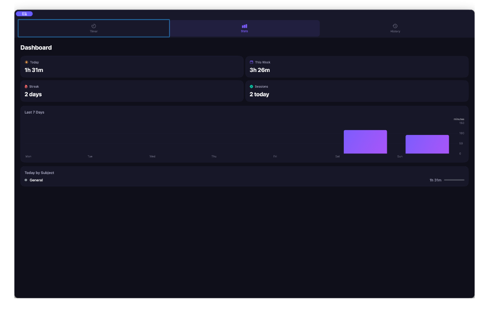

# StudyFlow ⏱

A native macOS Pomodoro timer and study tracking app built with SwiftUI & SwiftData.


## Features

- **Pomodoro Timer** — Focus, short break, and long break phases with a gorgeous animated progress ring
- **Menu Bar Integration** — Live countdown in your macOS menu bar so you don't need the app window open
- **Custom Tags** — Create and manage study tags with custom colors; toggle delete mode to remove tags (sessions reassigned to "General")
- **Adjustable Durations** — Tweak timer durations inline with ±5 min controls, or via Settings
- **Session Logging** — Every completed focus session is automatically saved with tag, duration, and timestamps
- **Statistics Dashboard** — Today's study time, weekly total, streak tracking, and a 7-day bar chart
- **Session History** — Browse past sessions grouped by date, filter by tag, swipe to delete
- **Notifications** — Native macOS notifications when phases complete, with optional sound

## Screenshots

### Statistics Dashboard


## Tech Stack

| Layer | Technology |
|-------|-----------|
| UI | SwiftUI |
| Data | SwiftData |
| Charts | Swift Charts |
| Timer | Combine (`Timer.publish`) |
| Notifications | UserNotifications |
| Platform | macOS 14+ (Sonoma) |

## Getting Started

### Prerequisites

- macOS 14.0 (Sonoma) or later
- Xcode 15+
- [XcodeGen](https://github.com/yonaskolb/XcodeGen) (for project generation)

### Build & Run

```bash
# Clone the repo
git clone https://github.com/YOUR_USERNAME/StudyFlow.git
cd StudyFlow

# Generate the Xcode project
xcodegen generate

# Open in Xcode and run (⌘R)
open StudyFlow.xcodeproj
```

## Project Structure

```
StudyFlow/
├── StudyFlowApp.swift          # App entry point + MenuBarExtra
├── Models/
│   ├── StudySession.swift      # SwiftData model for logged sessions
│   ├── Subject.swift           # SwiftData model for custom tags
│   └── TimerState.swift        # Timer phases, status, config
├── ViewModels/
│   ├── TimerViewModel.swift    # Core timer logic (Observable)
│   └── StatsViewModel.swift    # Statistics calculations
├── Views/
│   ├── ContentView.swift       # Tab navigation
│   ├── TimerView.swift         # Main timer UI
│   ├── StatsView.swift         # Statistics dashboard
│   ├── HistoryView.swift       # Session history
│   ├── SettingsView.swift      # App preferences
│   ├── MenuBarTimerView.swift  # Menu bar dropdown
│   └── Components/
│       ├── CircularProgressRing.swift
│       ├── StatCard.swift
│       ├── SessionRow.swift
│       └── ToastView.swift
├── Utils/
│   └── Theme.swift             # Design system (colors, gradients, spacing)
└── Assets.xcassets/            # App icon & accent color
```

## Design

- Dark theme with glassmorphism effects
- Indigo/violet gradients for focus, teal/blue for breaks
- Monospaced timer display with smooth animations
- Custom circular progress ring with glow effects

## License

MIT
